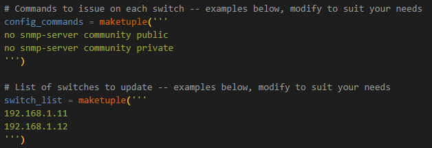

# Simple Network Command
A short script to automate changes to multiple devices.  Useful for quick changes to multiple devices.

## networkcommand

To use this script:
* modify the 'config_commands' tuple to contain all of the command(s) you want applied to the devices.
* modify the 'switch_list' tuple to contain the ip address of the devices

Examples:

User will be prompted for a login name, password and an enable password (optional).  It is assummed that the same credentials are valid for all of the devices.

Devices will be connected to one at at time, the commands issued and feedback provided to the screen on progress, success and failure.  There is no automatic rollback for failed / partial changes.

## Requirements
* netmiko >= 2.7.1